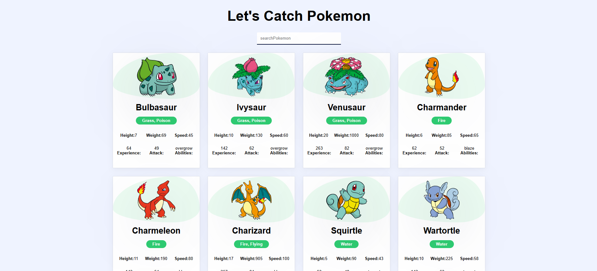

# pokemon-react

A fun project using React and Vite to explore and display Pokémon data in a simple, responsive interface.

## 🔥 Features

- Browse and view a list of Pokémon
- Fetch data from the [PokéAPI](https://pokeapi.co/)
- Clean UI built with React and CSS
- Fast development with Vite + HMR
- ESLint configured for clean code

## 📸 Preview



> *(Add a real screenshot or screen recording here to show how your app looks!)*

## 🚀 Tech Stack

- **React** – Frontend framework
- **Vite** – Lightning fast build tool
- **CSS** – For styling
- **PokéAPI** – Public API for Pokémon data

## Live Demo

Check out the live demo of the project here: [Pokemon React Demo](https://utsav377.github.io/pokemon-react/)


## 🛠️ Getting Started

1. Clone the repo

```bash
git clone https://github.com/Utsav377/pokemon-react.git
cd pokemon-react
